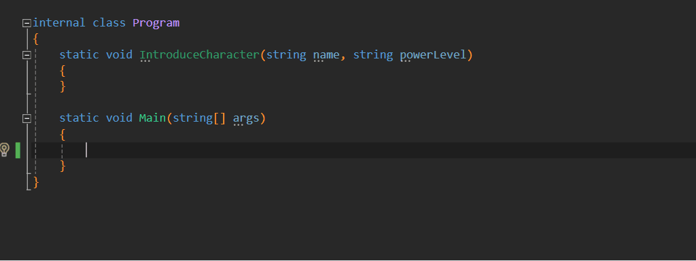

# Use named arguments for invocations of methods with multiple parameters of the same type.

## Motivation

Quoting from this [comment](https://github.com/dotnet/roslyn-analyzers/issues/1216#issuecomment-304967649
) in a [new analyzer request](https://github.com/dotnet/roslyn-analyzers/issues/1216#issuecomment-304967649).

> [...] analyzer here would enforce used of named arguments 
> when you have successive parameters of the same type 
> (or convertible to same type with implicit conversions).

## How does it work?

This analyzer looks at an invocation expression (e.g., a method call) and its arguments and suggests using named arguments according to the following rules:
- If a method or ctor has a number of parameters of the same type the invocation's corresponding arguments should be named.
- If named arguments are used for all but one parameter of the same type the analyzer doesn't emit a diagnostic. Two arguments of the same type cannot accidentally take each other's place in the described scenario. So the decision to have all the arguments named is a matter of code-style in this case and we leave it up to the developer.
- If the last parameter is `params`, the analyzer doesn't emit a diagnostic, as we cannot use named arguments in this case.

## Technical details

The analyzer, code-fix provider, and tests are implemented in F#

# Thank you!

- [John Koerner](https://github.com/johnkoerner) for [Creating a Code Analyzer using F#](https://johnkoerner.com/code-analysis/creating-a-code-analyzer-using-f/)
- [Dustin Campbell](https://github.com/DustinCampbell) for [CSharpEssentials](https://github.com/DustinCampbell/CSharpEssentials)
- [Alireza Habibi](https://github.com/alrz) for [CSharpUseNamedArgumentsCodeRefactoringProvider](https://github.com/dotnet/roslyn/blob/master/src/Features/CSharp/Portable/UseNamedArguments/CSharpUseNamedArgumentsCodeRefactoringProvider.cs) which provided very useful code examples.

# License

The [UseNamedArgs](https://github.com/mykolav/use-named-args-fs) analyzer and code-fix provider are licensed under the MIT license.  
So they can be used freely in commercial applications.
